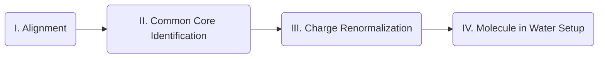

# Tutorial for Charge Renormalization using *msld_py_prep*

This tutorial was written for preparing input files for Multisite λ-Dynamics (MSλD) using a common core (multiple topology model, or MTM) setup for binding free energy calculations. However, the same scripts/steps can be used to set up free energy calculations for other small molecule transfer processes (e.g. solvation).

## Requirements:
- Python 3 or later versions, numpy, pandas
- PyMol
- [*MMTSB* Toolset]("http://feig.bch.msu.edu/mmtsb/Main_Page")

# Workflow
- [I. Alignment](#i-alignment-to-representative-molecule)
- [II. Common Core Identification](#ii-common-core-identification)
- [III. Charge Renormalization](#iii-charge-renormalization)
- [IV. Molecule in Water Setup](#iv-molecule-in-water-setup)
- [V. Final Steps](#v-final-steps)

## I. Alignment to Representative Molecule

**1.** Once the holo (bound) protein PDB structure that will be used for MSλD has been prepared (solvated and minimized), extract the representative ligand's coordinates from it and create a new .pdb file for the ligand only. 
> NOTE: Keep track of the solvation box size for the protein setup, as this number is necessary for the MSLD input scripts generated after running *msld_py_prep*.

**2.**  Draw the ligands that will be interrogated (e.g. by using a molecular visualization software like Chimera or PyMol) and subject them to a small minimization. Save them as a .mol2 file. Make sure the atom names within each molecule are unique (atom names *across* ligands may be reused). 

**3.**  Align the drawn ligands to the ligand in the binding site. One can use a visualization software or a command line tool like [Align-ItTM](http://silicos-it.be.s3-website-eu-west-1.amazonaws.com/software/align-it/1.0.4/align-it.html)

**4.**  Save the aligned ligands with a .mol2 extension.

## II. Common Core Identification

**1.**  Using ParamChem/CGenFF, or any other parameterization tool that generates parameters compatible with CHARMM, generate stream files (.str extension) with charges and parameters for each ligand.  Make sure to name these files the same as the corresponding .mol2 file. 

**2.** Place the .mol2 files and corresponding .str files for each ligand into the `msld_py_prep` directory

**3.**  For *msld_py_prep* scripts to work correctly, Python 3, numpy, and pandas will be needed. 

**4.**  Update the file named _mol_list.txt_ by typing the names of the ligands that will be used (for which there exist a .mol2 and .str file). Each line in this text file corresponds to a specific ligand name.

**5.**  Open _msld_py_prep.py_. Update the `sysname` variable with the name of your system. If CGenFF parameters are being used, set the `cgenff` variable to **True**.

**6.**  Run the _py_prep.py_ script. This should generate a file called _MCS_for_MSLD.txt_, which contains several things:
> a. The line beginning with _NSUBS_ contains information about how many different substituents are at each site.
> 
> b. The line beginning with _REFLIG_ includes the name of the ligand that is used as a reference to match every other ligand’s atoms to. This is not to be confused with the reference ligand used for the subsequent free energy calculations, although they could be the same.
> 
> c. The _CORE_ section includes a list of all of the ligands and the corresponding atom names that are in the core. The matched atoms are spatially aligned across ligands, meaning that each column corresponds to the atom names of all the ligands whose atoms are a match (or the ‘same’).
> 
> d. The _ANCHOR_ atom section corresponds to the atoms that connect the core to the different sites. Therefore, the first column after the ligand name corresponds to the anchor atoms for each ligand in the first site, the second column to those in the second site, and so on. If more than two atoms serve as anchors to a specific site, the variable _DUM_ will be used as a placeholder (meaning dummy atom). 
> The anchor atoms are the first atoms that connect to each fragment in a particular site and will become part of the fragment after the charge renormalization step. These atoms will appear in the _CORE_ section as well.   
> 
> e. Finally, the _SITE N FRAGMENTS_ section (where N corresponds to the site number) includes the unique fragments that are identified at each site across all of the queried ligands.
        
**7.** To visualize each of the ligands and the corresponding core and sites identified, open PyMol in a directory containing the ligand .mol2 files, the _MCS_for_MSLD.txt_ file, and the _vis_check.py_ script.

**8.**  Run the _vis_check.py_ script within PyMol. All of the ligands should load with the common core atoms represented as hard spheres (including anchor atoms). Check each ligand to make sure the desired core has been identified.

**NOTE** In this step, a maximum common substructure search (MCSS) is performed. Core and fragment atoms are identified based on their force field atom types. As a result, chiral groups will fail to be correctly identified as distinct and separate entities. A quick workaround to this problem is to rename a chiral atom's atom type in a compound's topology file prior to running this step of _msld_py_prep.py_. Then, after the MCSS has completed, return the chiral atom's atom type to its original form. The reminder of _msld_py_prep.py_ will work correctly and the chrial group will be included in the final MSLD ligand files. 

## III. Charge Renormalization

**1.**  Once a common core has been identified via the _MCS_for MSLD.txt_ output file, run the _msld_py_prep.py_ script once more. This should generate a directory called **`build.[sysname]`**, where the core and site specific fragments’ .pdb, .rtf and .prm files compatible with CHARMM are generated, as well as input scripts for CHARMM to perform MSλD.  

**3.**  Make sure that charge renormalization is not changing the original atom charges significantly by looking at the percentage charge difference between the renormalized and original atom charges that should print out as the script is running. Any charge renormalized ligand that shows more than a 5% charge difference from its original charge will be flagged.
>NOTE: If a significant charge deviation occurs, the user should modify the _MCS_for_MSLD.txt_ file to move atoms in the _CORE_ that may be causing the large charge deviations to the corresponding _SITE_N_FRAGMENTS_ section.

**4.**  Visualize the fragments and the core pdb files to make sure that the correct core was generated, as well as the desired fragments for each site.  

**5.** Check the .rtf files generated to make sure that the charges for all fragments at a specific site are the same and that the sum of the charges at each site and the core add up to the expected net charge of the ligands.

## IV. Molecule in Water Setup

**1.**  While this directory now contains the prepared ligands for MSλD for the ligand bound to a protein, we still need to generate unbound-solvated ligand files to perform the simulations for the ligand in water, as per a typical ligand binding thermodynamic cycle. 

**2.**  Within the `msld_py_prep` directory, run the _Lg_Solvate.sh_ bash script, which uses scripts from the MMTSB toolset, to solvate the ligands. This will generate a directory called  `solv_prep`, which contains the same .rtf and .prm files printed by _msld_py_prep.py_ but different .pdb files corresponding to new coordinates of the ligands in water. A *solvent.pdb* file is also generated. Make sure to make note of the box size, which should be printed when the script is run.  

**3.**  We have now generated CHARMM input files for MSLD.

## V. Final Steps

With all ligand .pdb, .rtf, and .prm files now generated, edit the _[sysname].inp_ file in the `solv_prep` or `build.[sysname]` directories to finish preparing your MSλD input script for CHARMM. This file can be edited to run MSλD independently, or truncated after the BLOCK section for use with the Adaptive Landscape Flattening (ALF) algorithm.
